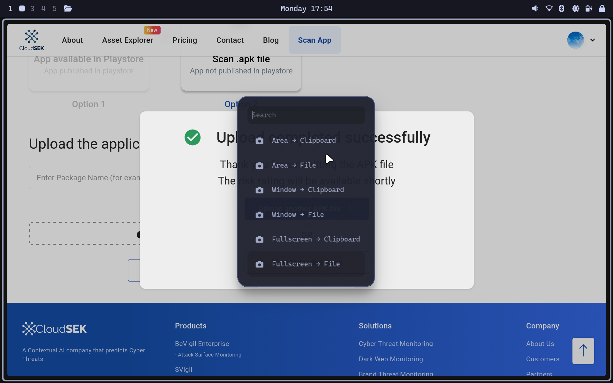
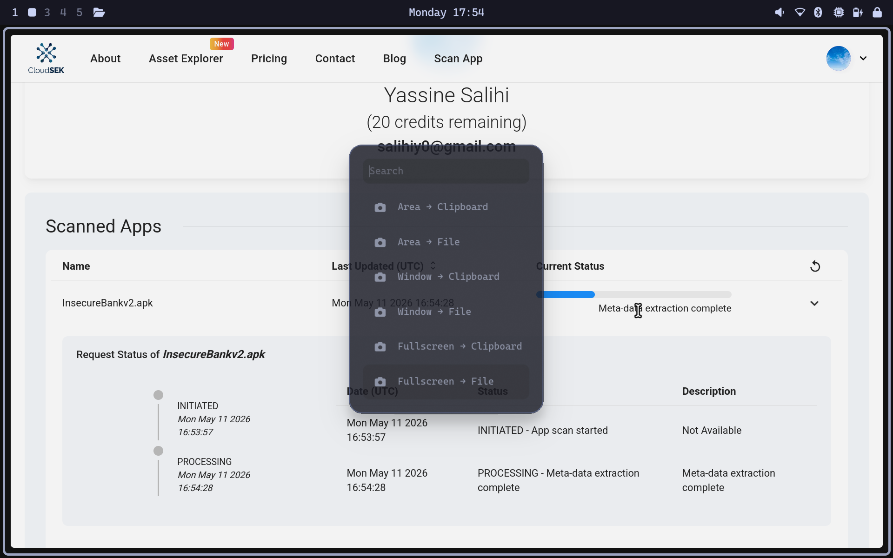
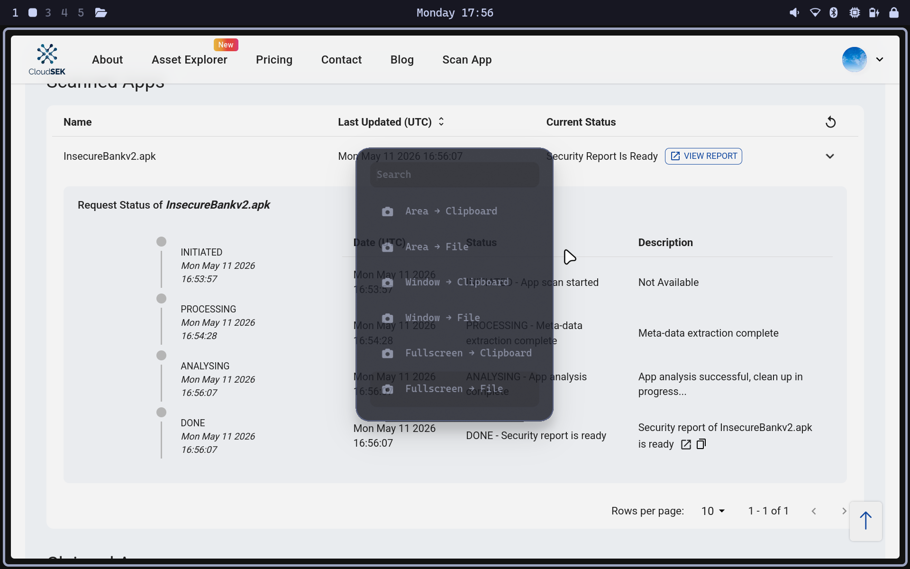
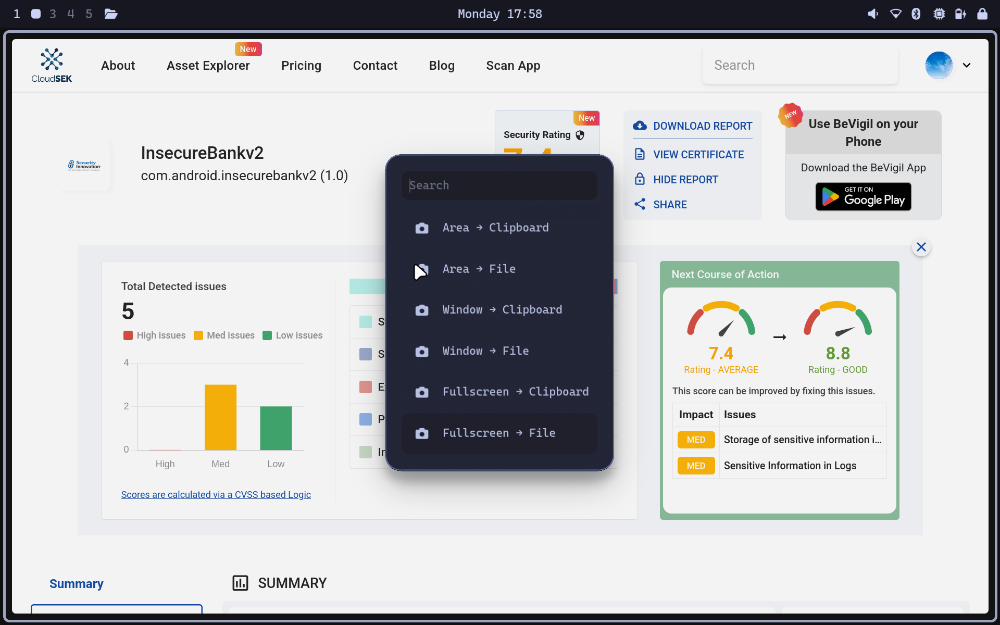

# LAB 8 : Analyse de posture et exposition d'applications mobiles

**Analyste:** SALIHI Yassine  
**Date:** 2026-05-11  
**Cible:** InsecureBankv2 (com.android.insecurebankv2)  

---

## Task 0 — Initialisation du scope

Création du fichier de périmètre :

```bash
mkdir -p 00-scope && touch 00-scope/scope.md
```

📄 Fichier créé : `00-scope/scope.md`

---

## Task 1 — Mise en place de la traçabilité

Création des fichiers de suivi :

```bash
touch analyse_info.txt commands.log
```

📄 Fichiers créés : `analyse_info.txt`, `commands.log`

---

## Task 2 — Acquisition et vérification de la cible

Copie de l'APK dans le scope et vérification du hash SHA256 :

```bash
cp UnCrackable-Level1.apk 00-scope/
sha256sum 00-scope/UnCrackable-Level1.apk
```

**Hash SHA256 :**
1da8bf57d266109f9a07c01bf7111a1975ce01f190b9d914bcd3ae3dbef96f21  UnCrackable-Level1.apk

> Note : L'analyse BeVigil a été réalisée sur **InsecureBankv2.apk** (com.android.insecurebankv2),
> application intentionnellement vulnérable utilisée pour ce lab.

---

## Task 3 — Analyse BeVigil

Projet créé : `LAB-BEGINNER-20260511`  
Export des résultats dans `01-bevigil/`

<!-- SCREENSHOT : page d'accueil du projet BeVigil -->


### Vulnérabilités détectées

| # | Règle | CWE | Fichier(s) |
|---|-------|-----|------------|
| 1 | Exported Activity | CWE-926 | AndroidManifest.xml |
| 2 | Weak Crypto (MD5) | CWE-327 | Google libs |
| 3 | SQL non paramétrée | CWE-89 | zzj.java |
| 4 | Insecure HTTP Client | CWE-757 | DoLogin, DoTransfer, ChangePassword |
| 5 | CBC Padding Oracle | N/A | CryptoClass.java |
| 6 | Object Deserialization | CWE-502 | zzw.java |

<!-- SCREENSHOT : liste des vulnérabilités dans BeVigil -->


<!-- SCREENSHOT : détail manifest issues -->


📄 Notes complètes : [`01-bevigil/bevigil_notes.md`](01-bevigil/bevigil_notes.md)

---





